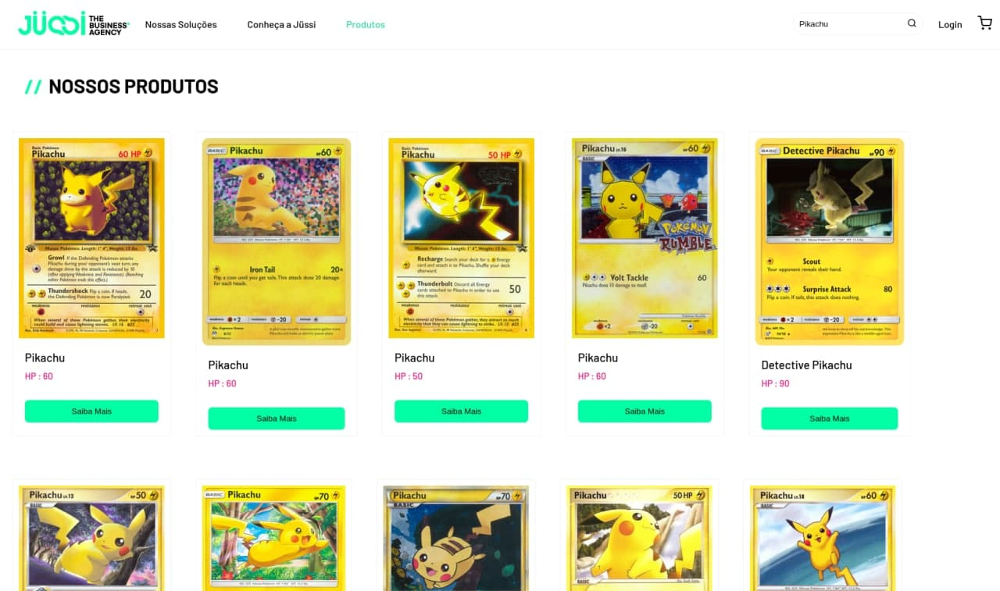

# Jussi

Is a React application that has an ecommerce-based homepage, and a Pokémon card search

É uma aplicação React que com uma página inicial baseada em um ecommerce, e com uma pesquisa de cartas de Pokemon




## Getting started / Para começar

Execute these below commands / Execute os seguintes comandos

```sh
git clone git@github.com:AndreLimaS/jussi.git
cd jussi
yarn install # to install dependencies
yarn start # open localhost:3000
```

## Credits / Creditos

[PokeMontCg](https://pokemontcg.io/) - used to get data / usado para obter as infromações dos Pokemons Cards

## Diary of developing / Diário do desenvolvimento

- Comecei com os downloads das imagens e o insert da font, criação das variáveis de cores e os estilos globais.

- Primeira etapa de desenvolvimento foi o Header e assim fui seguindo com a codificação do layout, componentizei tudo aquilo que seria reaproveitado e separei os blocos em containers para ter uma organização melhor.

- Decidi usar a API pokemontcs.oi, pois com as cartas de Pokemons daria um belo visual.

- Percebi que seria bom a criação de mais uma página para mostrar a pesquisa das cartas.

- Após o termino da codificação da página de produto, percebi necessário a criação de um context para fazer a pesquisa, e então parti para as requests e interações.

## To future / Para o futuro

- Add filters in product
- Add message not found cards pokemon
- Create page details
- Add tests
- Create Version Mobile
- Add skeleton loader

## Url access / acesso a url

[Jussi Url](https://jussi-teste.netlify.app/)
